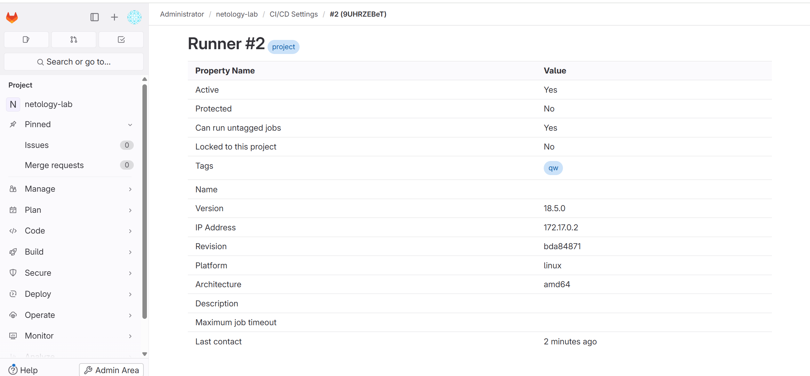

# 8.3 GitLab — Домашнее задание - `A. Oleg`


---

### Задание 1





---

### Задание 2

`1–2 предложения: lint — пишет lint.log, test — echo, package — создаёт артефакт dist/build-info.txt`

```
workflow:
  rules:
    - when: always

default:
  image: alpine:3.19

stages: [lint, test, package]

lint_yaml:
  stage: lint
  script:
    - echo "YAML check passed at $(date)" | tee lint.log
  artifacts:
    when: always
    expire_in: 1 week
    paths: [lint.log]
  tags: [docker, local]

test_ping:
  stage: test
  script:
    - echo "Runner OK on $(date)"
  tags: [docker, local]

package_dist:
  stage: package
  script:
    - mkdir -p dist
    - printf "Build done at %s\n" "$(date)" > dist/build-info.txt
  artifacts:
    name: "dist_$CI_COMMIT_SHORT_SHA"
    expire_in: 1 week
    paths: [dist/]
  tags: [docker, local]
```


---

